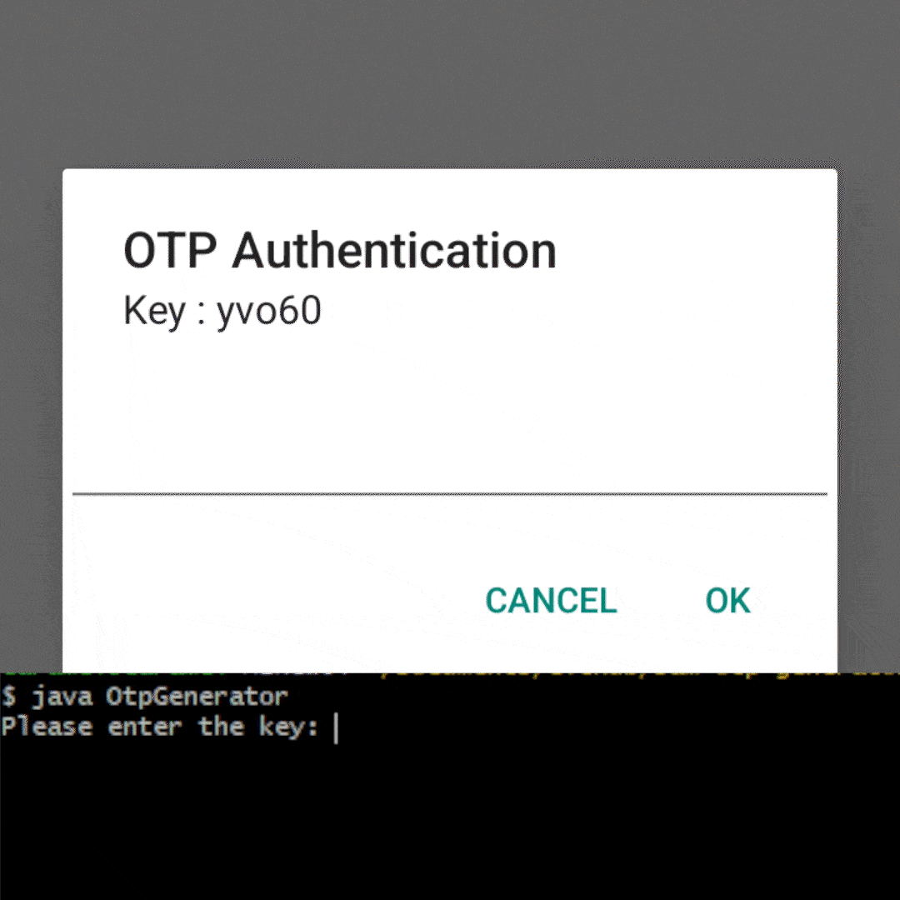

# sam-otp-generator

어느 전자기기 제조사의 히든 메뉴 [OTP](https://en.wikipedia.org/wiki/One-time_password) 생성기. 

> [!WARNING]
> 1. 본 프로그램은 기술 해석을 포함한 학술 연구를 위해 제작되었으며, 특정 회사를 공격하기 위해 제작된 것이 아님을 밝힙니다. 또한 특정 OTP와 생성 알고리즘이 동일 또는 유사하거나, 본 프로그램에서 생성된 인증 코드로 인증을 성공한 경우에도 이는 우연의 일치임을 알립니다.
> 2. sam은 한글 독음으로 [숫자 3](https://en.wikipedia.org/wiki/3)을 뜻하며, 실행 방법이 세 단계인 점에서 지어지게 된 이름입니다.
> 3. 본 프로그램을 사용하기로 한 경우, 사용하며 발생하는 모든 문제 및 책임은 사용자 본인에게 있습니다.

## 📖 실행 방법
1. 사용하기 전 [Java](https://en.wikipedia.org/wiki/Java_(programming_language))를 시스템에 설치하세요. _(Java 8 이상 필수)_
2. 이 리포지토리를 clone 후, 해당 디렉토리로 이동합니다.
```bash
git clone https://github.com/LemonCaramel/sam-otp-generator.git
cd sam-otp-generator
```
3. 다음 명령어를 사용하여 프로그램을 실행합니다.
```bash
java OtpGenerator
```

## 🖥️ 예시

